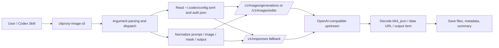
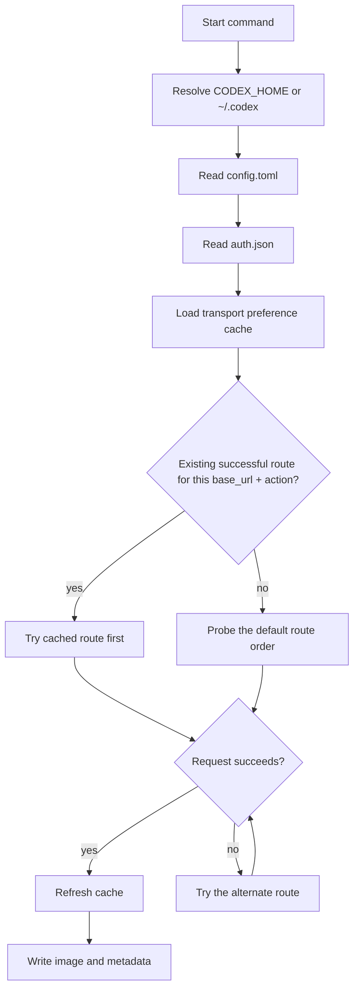

# cliproxy-image-cli

[简体中文](./README.md)

Installable Codex-native CLI for image generation and image editing by reusing your local Codex OpenAI-compatible configuration.

## Highlights

- **Codex-native reuse**: automatically reads the local Codex `base_url` and `OPENAI_API_KEY`
- **Two core commands**: supports both `generate` and `edit`
- **Flexible image inputs**: works with local files, URLs, and `data:` image sources
- **Local-file friendly**: supports file output, directory output, overwrite protection, and metadata export
- **Automatic transport reuse**: remembers the successful route for the same upstream and action
- **Skill / shell / automation ready**: designed for Codex skills, terminal usage, and scripted flows

## Features

- `generate`: calls `/v1/images/generations`
- `edit`: calls `/v1/images/edits`
- automatic Codex config and credential discovery
- automatic conversion of local images into `data:` URLs
- fallback to `/v1/responses` when direct image endpoints are unavailable
- optional metadata export for saved results

## Requirements

- Node.js 18+
- Codex installed locally
- Codex configured with a working OpenAI-compatible upstream
- an upstream that supports at least one of:
  - `/v1/images/*`
  - image generation or editing through `/v1/responses`

## Installation

### npm

```bash
npm install -g cliproxy-image-cli
```

### Homebrew

```bash
brew tap noooob-coder/tap
brew install cliproxy-image-cli
```

## Project structure

```text
bin/
  cliproxy-image-cli.js        # CLI entrypoint
lib/
  image-cli.js                 # core command flow, API calls, save logic
Formula/
  cliproxy-image-cli.rb        # Homebrew formula
skill_src/
  cliproxy-image-cli/          # Codex skill wrapper and agent config
README.md                      # Chinese documentation
README.en.md                   # English documentation
package.json                   # npm package definition
```

This structure maps to three practical layers:

- **CLI runtime layer**: `bin/` and `lib/`
- **distribution layer**: `package.json` and `Formula/`
- **Codex integration layer**: `skill_src/`

## Quick start

The CLI automatically reads from your local Codex home, usually:

```text
~/.codex/config.toml
~/.codex/auth.json
```

So you normally do not need to pass a base URL, port, or API key manually.

### Generate an image

```bash
cliproxy-image-cli generate \
  --output ./astronaut-cat.png \
  --size 1024x1024 \
  --quality high \
  "A cinematic orange cat wearing an astronaut helmet"
```

### Edit an image

```bash
cliproxy-image-cli edit \
  --image ./input.png \
  --mask ./mask.png \
  --output ./edited.png \
  "Replace the background with snowy mountains while keeping the subject unchanged"
```

### Save metadata too

```bash
cliproxy-image-cli \
  --metadata-path ./request.json \
  generate \
  --output ./result.png \
  "A watercolor landscape at sunrise"
```

If `--output` is omitted, the CLI saves into the current working directory and chooses a clear default filename instead of overwriting an existing file directly. Size handling matches `imagegen`: the default is `1024x1024`, and the accepted values are `1024x1024`, `1536x1024`, `1024x1536`, or `auto`.

## Architecture diagrams

### Runtime flow



### Autodiscovery and transport cache



## Command reference

### Global options

- `--timeout <seconds>`: request timeout, default `300`
- `--metadata-path <file>`: write saved-result metadata and response details to JSON
- `--overwrite`: allow overwriting existing output files

### `generate`

```bash
cliproxy-image-cli generate [options] [--output <file|dir>] <prompt>
```

Options:

- `--model <name>`: default `gpt-image-2`
- `--prompt-file <file>`
- `--output <file|dir>`
- `--size <WxH>`: `1024x1024|1536x1024|1024x1536|auto` (default `1024x1024`)
- `--quality <value>`
- `--background <value>`
- `--moderation <value>`
- `--partial-images <count>`
- `--output-format png|jpeg|webp`
- `--response-format b64_json|url`

### `edit`

```bash
cliproxy-image-cli edit [options] --image <path|url> [--output <file|dir>] <prompt>
```

Options:

- `--image <path|url>`: repeatable, required
- `--mask <path|url>`
- `--output <file|dir>`
- all shared generate options
- `--input-fidelity <value>`

## How autodiscovery works

The CLI resolves runtime credentials in this order:

1. use `CODEX_HOME` if set, otherwise `~/.codex`
2. read the active `model_provider` and `base_url` from `config.toml`
3. read `OPENAI_API_KEY` from `auth.json`

If Codex points at an OpenAI-compatible upstream exposing `/v1`, the CLI maps image requests to:

- `.../v1/images/generations`
- `.../v1/images/edits`

without asking you for a port or base URL.

## Transport preference cache

If only one route actually works for a given upstream:

- direct image endpoints: `/v1/images/generations` / `/v1/images/edits`
- or the Responses fallback: `/v1/responses`

the CLI stores the successful transport in:

```text
~/.codex/cliproxy-image-cli-preferences.json
```

Later requests for the same `base_url` and action will prefer that cached transport instead of probing every interface again.

Cache behavior:

- keyed by `base_url + generate/edit`
- `generate` and `edit` are remembered separately
- if the cached preferred transport later fails, the CLI retries the alternate route and refreshes the cache

## Troubleshooting

If autodiscovery succeeds but the current Codex upstream does not really implement image endpoints, the CLI prints a targeted diagnostic including:

- the discovered Codex base URL
- the image endpoint that was called
- the model name
- the upstream error text

Typical example:

```text
Error: The local Codex configuration was discovered successfully, but the current upstream provider does not support image generation.
Base URL: http://your-provider/v1
Endpoint: http://your-provider/v1/images/generations
Model: gpt-image-2
Upstream response: upstream did not return image output
Action: point Codex at an OpenAI-compatible provider that implements the image endpoints.
```

If you see this, it usually means:

- the CLI itself is working
- the Codex `model_provider` / `base_url` should be changed
- the target upstream must support `/v1/images/*` or an image-capable `/v1/responses` flow

## License

This project is no longer distributed under MIT.

- **Allowed**: personal study, research, evaluation, and internal non-commercial testing
- **Prohibited without separate authorization**: commercial use, resale, paid distribution, and monetized service integration
- **Commercial use or sale**: requires a separate written commercial license and payment of the applicable fee

See [`LICENSE`](./LICENSE) for the full terms.
