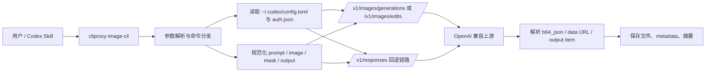
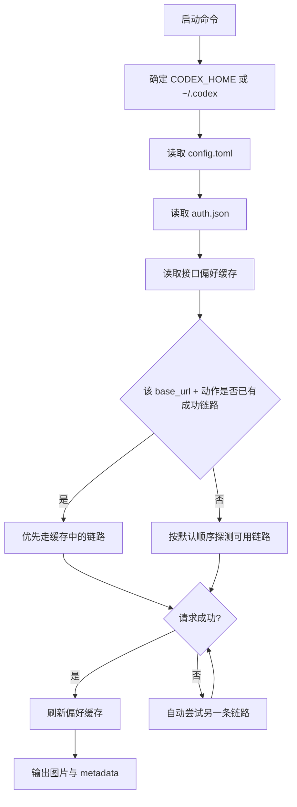

# cliproxy-image-cli

[English](./README.en.md)

可安装的 Codex 原生图片 CLI。它会自动复用本机 Codex 的 OpenAI 兼容配置，把图片生成与图片编辑能力直接带到命令行。

## 项目亮点

- **Codex 原生复用**：自动读取本地 Codex 的 `base_url` 与 `OPENAI_API_KEY`
- **双命令覆盖**：同时支持 `generate` 与 `edit`
- **多种图片输入**：支持本地文件、URL、`data:` 图片
- **本地文件友好**：支持文件输出、目录输出、覆盖保护与 metadata 导出
- **自动接口偏好记忆**：同一上游成功过的链路会被缓存，后续优先复用
- **适合 Skill / Shell / 自动化**：可直接用于 Codex skill、终端脚本和流水线

## 功能特性

- `generate`：调用 `/v1/images/generations`
- `edit`：调用 `/v1/images/edits`
- 自动发现本地 Codex 配置与认证信息
- 自动把本地图片转换为 `data:` URL 再上送
- 当直连图片接口不可用时，可回退到 `/v1/responses`
- 支持输出保存结果对应的 metadata JSON

## 运行要求

- Node.js 18+
- 本机已安装 Codex
- Codex 已配置可用的 OpenAI 兼容上游
- 上游至少支持以下其中一种：
  - `/v1/images/*`
  - 基于 `/v1/responses` 的图片生成 / 编辑链路

## 使用方式

### 1. 安装 CLI

#### npm

```bash
npm install -g cliproxy-image-cli
```

#### Homebrew

```bash
brew tap noooob-coder/tap
brew install cliproxy-image-cli
```

### 2. 安装 Codex skill

把仓库中的 `skill_src/cliproxy-image-cli` 复制到本机 Codex skill 目录即可。

#### macOS / Linux

```bash
mkdir -p ~/.codex/skills
cp -R ./skill_src/cliproxy-image-cli ~/.codex/skills/cliproxy-image-cli
```

#### Windows PowerShell

```powershell
New-Item -ItemType Directory -Force "$HOME\.codex\skills" | Out-Null
Copy-Item -Recurse -Force .\skill_src\cliproxy-image-cli "$HOME\.codex\skills\cliproxy-image-cli"
```

安装完成后，Codex 就可以直接加载这个 skill。

### 3. 在 Codex 中如何调用

安装好 skill 后，可以在 Codex 里直接输入自然语言调用，例如：

```text
请使用 cliproxy-image-cli skill 生成一张电影感橘猫宇航员海报，保存到当前目录
```

也可以显式写成：

```text
$cliproxy-image-cli 画一张雪山下的科幻小屋，保存为当前目录中的图片文件
```

如果你已经安装了这个 skill，很多普通图片请求也可以直接触发，例如：

```text
画一张日出水彩风景图
```

```text
把这张图片的背景换成雪山，输出到当前工作目录
```

## 项目结构

```text
bin/
  cliproxy-image-cli.js        # CLI 入口
lib/
  image-cli.js                 # 核心命令流程、接口调用、保存逻辑
Formula/
  cliproxy-image-cli.rb        # Homebrew Formula
skill_src/
  cliproxy-image-cli/          # Codex skill 包装与 agent 配置
README.md                      # 中文说明
README.en.md                   # 英文说明
package.json                   # npm 包定义
```

这个结构对应三层能力：

- **CLI 运行层**：`bin/` 与 `lib/`
- **分发安装层**：`package.json` 与 `Formula/`
- **Codex 集成层**：`skill_src/`

## 快速开始

CLI 默认会从本机 Codex 目录读取：

```text
~/.codex/config.toml
~/.codex/auth.json
```

所以通常不需要手动传 base URL、端口或 API key。

### 生成图片

```bash
cliproxy-image-cli generate \
  --output ./astronaut-cat.png \
  --size 1024x1024 \
  --quality high \
  "一只戴着宇航员头盔的电影感橘猫"
```

### 编辑图片

```bash
cliproxy-image-cli edit \
  --image ./input.png \
  --mask ./mask.png \
  --output ./edited.png \
  "保留主体不变，把背景替换成雪山"
```

### 同时保存 metadata

```bash
cliproxy-image-cli \
  --metadata-path ./request.json \
  generate \
  --output ./result.png \
  "日出时分的水彩风景"
```

如果省略 `--output`，CLI 会默认把图片保存到当前工作目录，并自动生成清晰的默认文件名，避免直接覆盖已有文件。尺寸策略与 `imagegen` 一致：默认 `1024x1024`，可选 `1024x1024`、`1536x1024`、`1024x1536` 或 `auto`。

## 架构图

### 运行链路



### 自动发现与接口偏好缓存



## 命令说明

### 全局参数

- `--timeout <seconds>`：请求超时秒数，默认 `300`
- `--metadata-path <file>`：把保存结果与响应信息写入 JSON
- `--overwrite`：允许覆盖已有输出文件

### `generate`

```bash
cliproxy-image-cli generate [options] [--output <file|dir>] <prompt>
```

可选参数：

- `--model <name>`：默认 `gpt-image-2`
- `--prompt-file <file>`
- `--output <file|dir>`
- `--size <WxH>`：`1024x1024|1536x1024|1024x1536|auto`（默认 `1024x1024`）
- `--quality <value>`
- `--background <value>`
- `--moderation <value>`
- `--partial-images <count>`
- `--output-format png|jpeg|webp`
- `--response-format b64_json|url`

### `edit`

```bash
cliproxy-image-cli edit [options] --image <path|url> [--output <file|dir>] <prompt>
```

可选参数：

- `--image <path|url>`：可重复，必填
- `--mask <path|url>`
- `--output <file|dir>`
- 其余生成共享参数与 `generate` 一致
- `--input-fidelity <value>`

## 自动发现机制

CLI 按以下顺序解析运行凭据：

1. 优先读取 `CODEX_HOME`，否则使用 `~/.codex`
2. 从 `config.toml` 读取当前 `model_provider` 及其 `base_url`
3. 从 `auth.json` 读取 `OPENAI_API_KEY`

如果 Codex 指向的是一个暴露 `/v1` 的 OpenAI 兼容上游，CLI 会自动把图片请求映射到：

- `.../v1/images/generations`
- `.../v1/images/edits`

用户无需关心端口或 base URL。

## 接口偏好缓存

如果某个上游只有一条链路真正可用：

- 直连图片接口：`/v1/images/generations` / `/v1/images/edits`
- 或 Responses 回退：`/v1/responses`

CLI 会把这次成功的传输方式缓存到：

```text
~/.codex/cliproxy-image-cli-preferences.json
```

后续同一 `base_url` 下的同类请求会优先复用已成功的链路，而不是每次都循环探测所有接口。

缓存规则：

- 按 `base_url + generate/edit` 分开记录
- `generate` 和 `edit` 分别维护自己的成功链路
- 如果缓存的优先链路失效，CLI 会自动尝试另一条链路并刷新缓存

## 故障排查

如果自动发现成功，但当前 Codex 上游并没有真正实现图片接口，CLI 会输出更明确的诊断信息，包括：

- 发现到的 Codex base URL
- 实际调用的图片端点
- 当前模型名
- 上游返回的错误文本

典型输出示例：

```text
Error: The local Codex configuration was discovered successfully, but the current upstream provider does not support image generation.
Base URL: http://your-provider/v1
Endpoint: http://your-provider/v1/images/generations
Model: gpt-image-2
Upstream response: upstream did not return image output
Action: point Codex at an OpenAI-compatible provider that implements the image endpoints.
```

如果看到这类报错，通常说明：

- CLI 本身工作正常
- 当前需要调整的是 Codex 的 `model_provider` / `base_url`
- 目标上游需要支持 `/v1/images/*` 或支持图片的 `/v1/responses`

## 许可证

本项目不再使用 MIT。

- **允许**：个人学习、研究、评估、内部非商用测试
- **禁止**：未获授权的商用、转售、付费分发、SaaS/托管/API 商业服务集成
- **商用与出售**：必须事先获得作者单独书面授权，并支付商业许可费用

完整条款见 [`LICENSE`](./LICENSE)。

## 致谢

- 感谢 [LinuxDo](https://linux.do/) 社区的交流、分享与反馈。